# ARM (.NET)

## Overview

In this lab, you will learn to provision and manage resources in Azure with the new Azure Resource Manager.  Then we will deploy our sample application into newly created infrastructure.

## Objectives

In this hands-on lab, you will learn how to:

* Author Azure Resource Manager templates.
* Deploy ARM Templates to Azure.
* Integrate environments into ADO Release pipelines.
* Deploy City Power & Light to new Web App.

## Prerequisites

* You should have completed the previous Continuous Integration HOL.
* You should install the Windows Azure SDK from <https://go.microsoft.com/fwlink/?LinkId=518003&clcid=0x409>.

## Exercises

This hands-on-lab has the following exercises:

* [Exercise 1: Create an ARM Template in Visual Studio](#ex1)
* [Exercise 2: Deploy ARM Template to Azure](#ex2)
* [Exercise 3: Integrate new Web App into ADO](#ex3)
* [Exercise 4: Deploy City Power & Light to new Web App](#ex4)

### Note

> In the hands-on-labs you will be using Visual Studio Solutions. Please do not update the NuGet packages to the latest available, as we have not tested the labs with every potential combination of packages.

---

## Exercise 1: Create an ARM Template in Visual Studio<a name="ex1"></a>

1. Install [Visual Studio 2019](https://visualstudio.microsoft.com/vs/)
2. Install the `Azure development` extension

    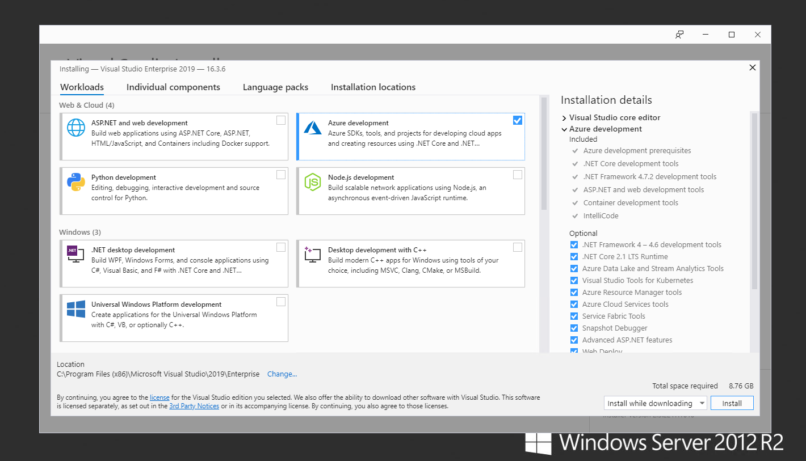

3. Log In with your account Proge-Software

    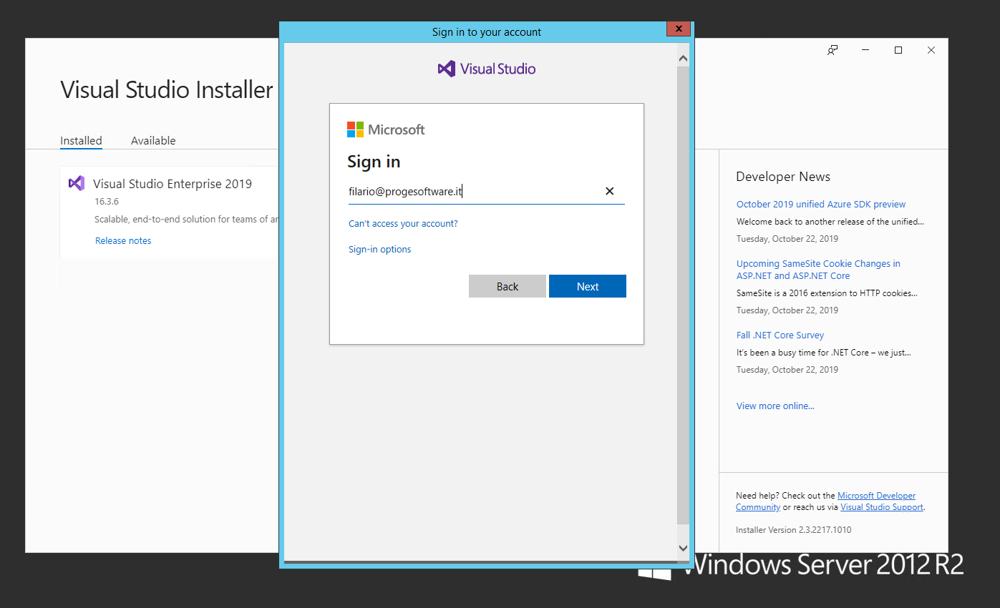

4. Select `Create a new Project`.
  
    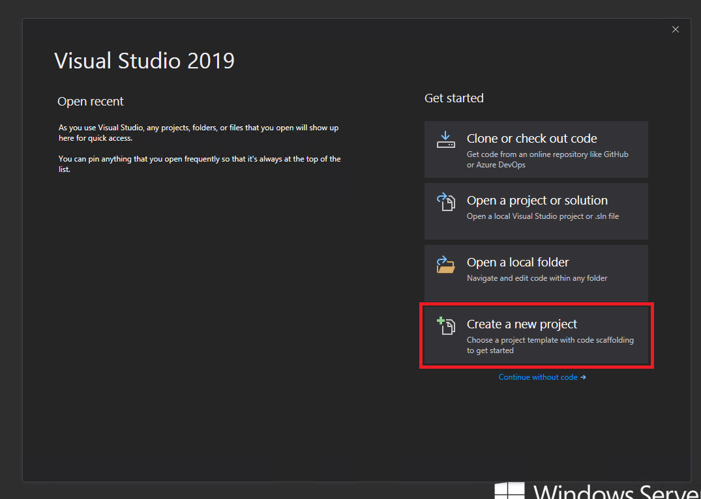

5. Search for `Azure Resource Group` and select `Azure Resource Group`

    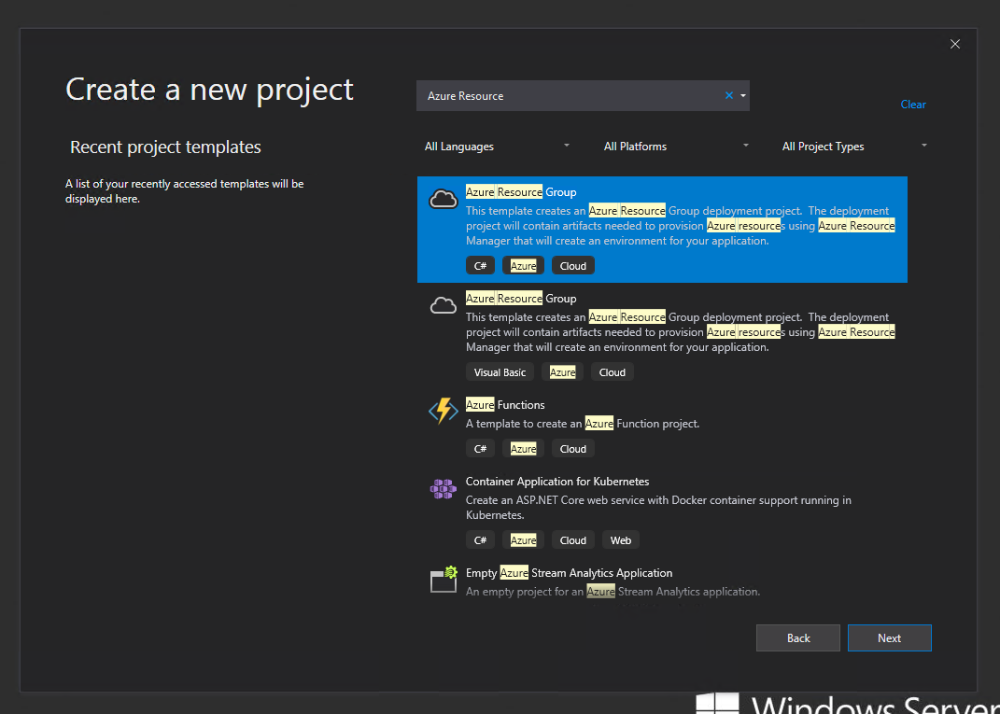


6. Fill the Project configuration form

    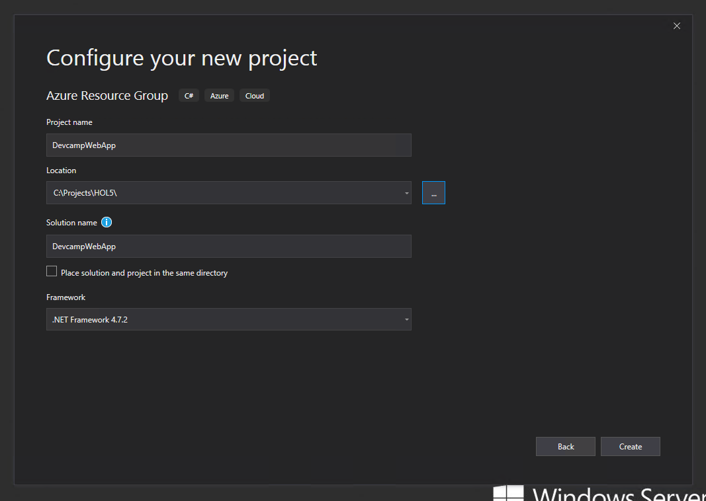

7. In the `Select Azure Template` window, find the `Web App` template and select it. Click `OK`.
   This will create an Azure Resource project and add a web application resource.

    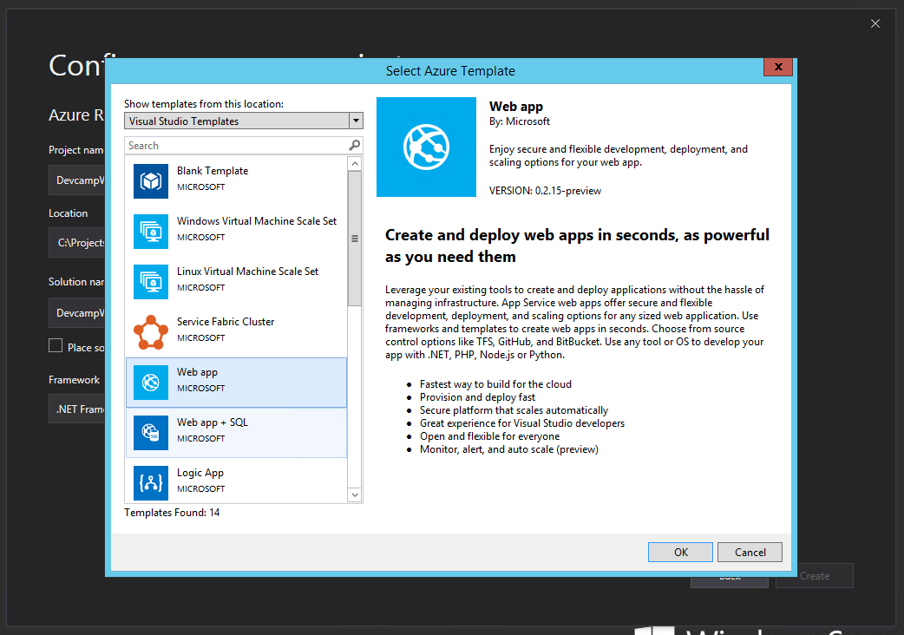

8. Open `Solution Explorer` and review the assets. Select the `WebSite.json` file and open it in the editor.

    

9.  The `JSON Editor` tool pane will open and provide an outline of the ARM Template. Expand each section to view the content.

    

    > Note: If the tool pane does not open, ensure that you have the latest Azure SDK installed. At the time of this writing, the latest version is 2.9.

10. Our new web application will need a globally unique DNS name. Locate the `webSiteName` variable. This will synchronize the editor view with the outline view. In the editor, replace the existing value ***webSite*** with ***dotnetapptest*** and your account name as usual e.g. ***gdinardo***.

    

    > At the time when this training has been prepared, there is a bug in the Visual Studio `Web App` ARM template. 
    You should fix it manually. 
    Find the resource type `Microsoft.Insights/components` (line 282) and change the location from `East US` to `[resourceGroup().location]`:
    >
    > 

11. The web application needs to be configured to work with the AzureAD, Azure Storage, Azure Redis Cache, and ASP.NET WebAPI that we configured earlier.

    In earlier exercises we have configured these settings as `Web.config` variables on our local machines, and in the Azure Portal for our `DevCamp` Azure Web App.  

    ARM Templates can include child `resources`, which define options for a given parent resource. For a web app, we can add `appsettings` to adjust the environment variables present on our app, instead of or in addition to using web.config.

12. In the JSON outline tool pane, select the `Website` parent resource. Right-click and select `Add New Resource`.

     

13. Locate the `Application Settings for Web Apps` resource and select it. Enter a name and click `Add`.

     

14. Locate the `Properties` node in the Application Settings resource.

     

15. Replace the properties node with the following:

    ```JSON
    "properties": {
        "AZURE_STORAGE_ACCOUNT": "[YOUR STORAGE ACCOUNT NAME]",
        "AZURE_STORAGE_ACCESS_KEY": "[YOUR STORAGE ACCOUNT KEY]",
        "AZURE_STORAGE_BLOB_CONTAINER": "images",
        "AZURE_STORAGE_QUEUE": "thumbnails",
        "INCIDENT_API_URL": "https://[YOUR API APPLICATION NAME].azurewebsites.net",
        "REDISCACHE_HOSTNAME": "[YOUR REDIS CACHE NAME].redis.cache.windows.net",
        "REDISCACHE_PORT": "6379",
        "REDISCACHE_SSLPORT": "6380",
        "REDISCACHE_PRIMARY_KEY": "[YOUR REDIS CACHE KEY]",
        "AAD_APP_ID": "[YOUR APP ID]",
        "AAD_APP_SECRET": "[YOUR CLIENT SECRET]",
        "AAD_APP_REDIRECTURI": "[concat('https://', variables('webSiteName'), '.azurewebsites.net/')]",
        "AAD_INSTANCE": "https://login.microsoftonline.com/{0}/{1}",
        "AAD_AUTHORITY": "https://login.microsoftonline.com/common/",
        "AAD_LOGOUT_AUTHORITY": "https://login.microsoftonline.com/common/oauth2/logout?post_logout_redirect_uri=",
        "AAD_GRAPH_SCOPES": "openid email profile offline_access Mail.ReadWrite Mail.Send User.Read User.ReadBasic.All",
        "GRAPH_API_URL": "https://graph.microsoft.com"
    }
    ```

16. Locate the values surrounded by `[YOUR ...]`. We will need to replace these values with the correct settings for your web application. You can get these values from the `Web.config` created in the previous labs.

17. If you do not have the values from the previous labs, open the Azure portal and find the web application in your resource group that starts with `dotnetapp...`.

18. Select `Application Settings` from the settings blade:

    

19. Copy the values by double-clicking in the cell and copying the values. Paste them into the ARM template in the correct location that matches the key name.

    > If you do not have the `Application Settings` you may have not completed the previous HOL and have to manually add them.

    

    

We are now ready to deploy our ARM Template containing an App Service Plan, and a Web App with environment variables to Azure.

---

## Exercise 2: Deploy ARM Template to Azure using Visual Studio<a name="ex2"></a>

1. In Visual Studio, select the ARM Project. `Right-click` and select `Deploy` -> `New...`:

    

1. Select your subscription and resource group from the drop-downs and click `Deploy`.

    

1. A pop up will appear where you can enter a name for your app service and select the App Service plan.
    Enter the name of the existing plan `incidentappplan4ig5etm56nkem`.

     

1. Click `Save`.

    > If Visual Studio fails to deploy the template and you receive the error message `Add-AzureRmAccount: The term 'Add-AzureRmAccount' is not recognized...` open an interactive Powershell (`View` -> `Other Windows` -> `Powershell Interactive Window`).
    > Enter `Connect-AzureRmAccount`.
    > It should prompt you to log in. Follow the instructions.
    > Redeploy the template.

1. Open the [Azure Portal](https://portal.azure.com) and verify that the app has been created in your resource group with the defined resources.

    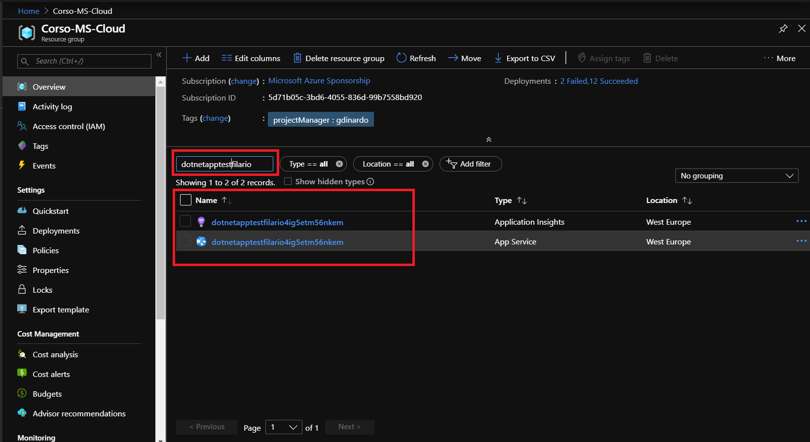

    Also check the `Configuration` blade to verify that the environment variables were created as expected:

    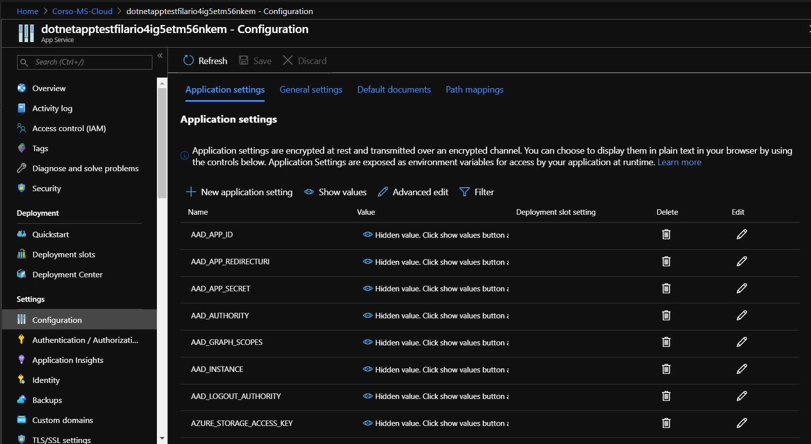

1. To use authentication with this new web app, we need to update our AzureAD app registration to whitelist your application URI. 
   Navigate to the [Application Registration Portal](https://portal.azure.com/#blade/Microsoft_AAD_RegisteredApps/ApplicationsListBlade) and select the blade `Authentication`.
   Add the URI in a new spot in the section `Redirect URIs` and finally select `Save`.

    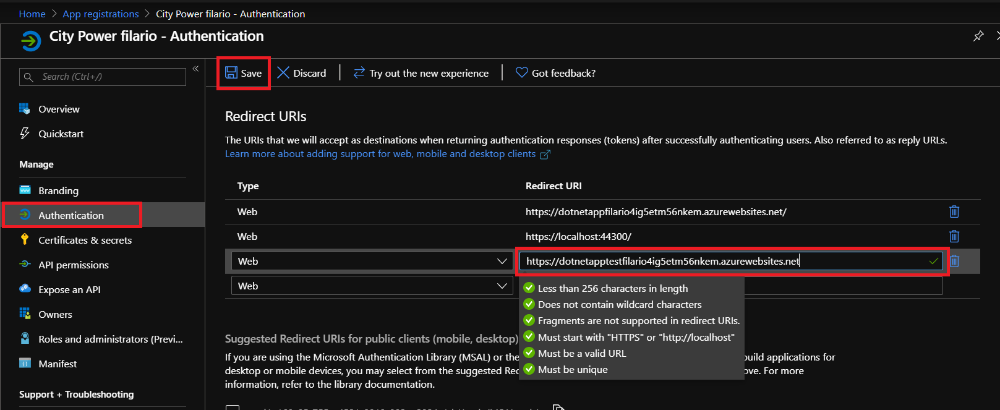

    > See [here](https://azure.microsoft.com/en-us/documentation/articles/active-directory-v2-limitations/#restrictions-on-redirect-uris) for more information about redirect URIs.
    >
    > If you encounter error messages in the browser please try a redeploy via Visual Studio.

The resource group is now holding our "Test" environment web app and has been added to our app registration.

---

## Exercise 3: Integrate new Web App into ADO<a name="ex3"></a>

1. In [ADO](https://dev.azure.com/), open the `Pipelines` blade and then select the `Releases` one. 
   Select the `Release Pipeline` that we started in a previous lab. 
   We need to create a second environment to serve as our test web app.
   Select `Edit`.

    

2. In the Release pipeline, first select `Stage 1`, then select `Clone`. 
   We will use our existing Dev web app configuration as the template for the new test web app configuration.

    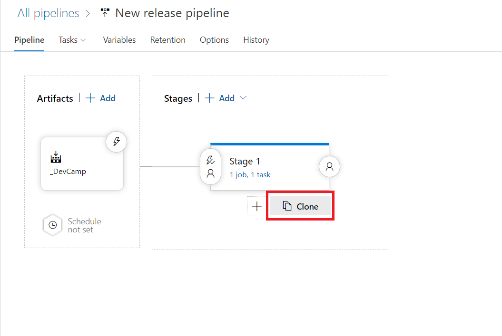

3. Rename the environment from **Copy of...** to **Test** by clicking on it's title.

    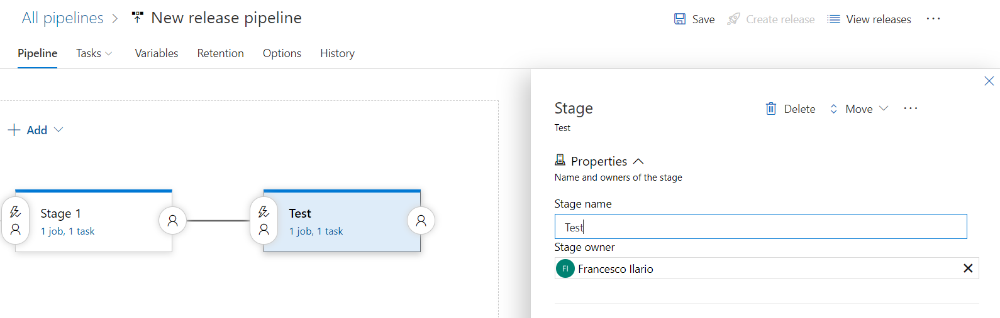

4. ADO allows us to control and govern how releases happen between environments. Instead of automatically deploying our test environment after our dev environment, let's add an approval step. A user can look at the dev environment, confirm it is is ready, and then authorize a release to the test environment. Click the `Pre-deployment conditions` icon on the left side of the test environment, select the `After environment` trigger and the first environment:

    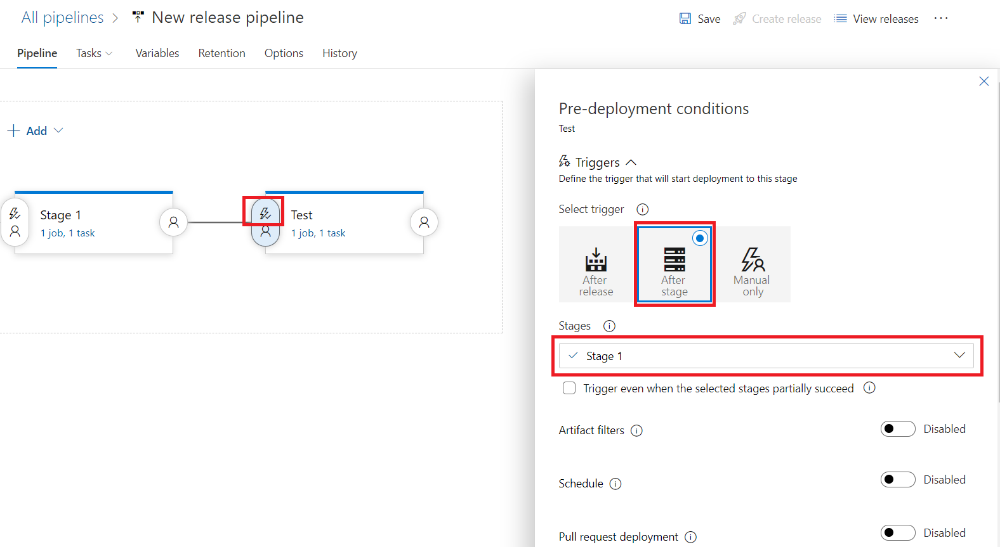

    For the `Pre-deployment approvers` option, enter your account name and make sure `User requesting a release or deployment should not approve` is **not** checked. Then click the `Save` button:

    

5. Switch to the `Tasks` blade. Update the `App service name` to match the web app that you just deployed via the ARM Template. The task now targets the test environment web app, rather than the dev environment web app.

    

6. Save your Release Definition to finish adding the additional environment.

---

## Exercise 4: Deploy City Power & Light to new Web App<a name="ex4"></a>

With the updated Release Definition, we can now execute a release.

1. Click on the `Release` button and in the drop-down choose `Create Release`.

    

1. Select a Build to release into the environments. This is likely the largest numbered Build. Then click the `Create` button.

    

1. Click the Release number to navigate to the Release Details screen

    

1. On the top toolbar, select `Logs` to monitor the release process. When the release for the dev environment finishes, you will be prompted to approve the release to the test environment. Click `Approve` to continue the release.

    

1. Once the test environment app has finished its release, open the app in the browser and login.

    

    > Before you are trying to login make sure that you are browsing the https version of the app or a redirect loop will occur.

We have now created a new "test" environment web app and app service plan via an ARM Template, and integrated the new environment into our ADO Release Definition.

---

## Summary

In this hands-on lab, you learned how to:

* Create an ARM Template in Visual Studio Code.
* Deploy ARM Template to Azure via the XPlat CLI.
* Integrate new Web App into ADO.
* Deploy City Power & Light to new Web App.

After completing this module, you can continue on to Module 6: Monitoring with Application Insights.

### View Module 6 instructions for [.NET](../06-appinsights)

---
Copyright 2018 Microsoft Corporation. All rights reserved. Except where otherwise noted, these materials are licensed under the terms of the MIT License. You may use them according to the license as is most appropriate for your project. The terms of this license can be found at <https://opensource.org/licenses/MIT>.