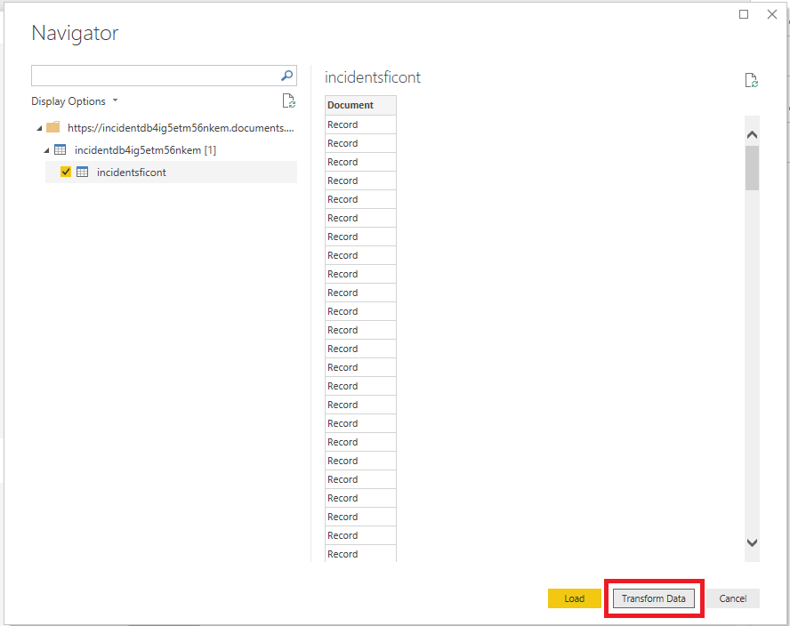
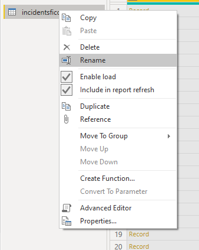
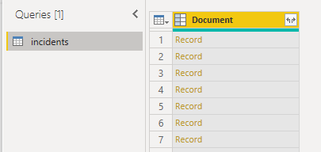
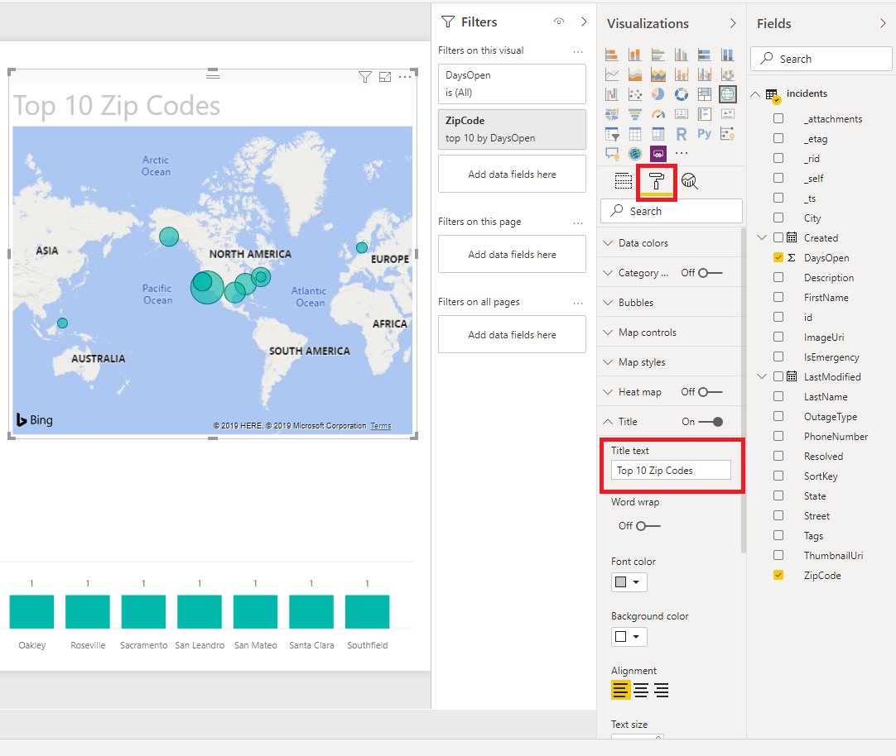

# Visualizing data using PowerBI (ALL)

## Overview
In this lab, you will create a Power BI report to visualize the Incident data.

## Objectives
In this hands-on lab, you will learn how to:
* Connect to data in Cosmos DB using Power BI
* Add a calculated column to a Power BI report
* Publish and view a report to the Power BI service

## Prerequisites

* Have an Incidents API and Cosmos DB deployed to an Azure subscription
* A Windows machine with a Power BI Supported Operating System
    - Windows 10 , Windows 7, Windows 8, Windows 8.1, Windows Server 2008 R2, Windows Server 2012, Windows Server 2012 R2
    - Microsoft Power BI Desktop requires Internet Explorer 9 or greater.
    - Microsoft Power BI Desktop is available for 32-bit (x86) and 64-bit (x64) platforms.

## Exercises
This hands-on-lab has the following exercises:
* [Exercise 1: Set up your environment](#ex1)
* [Exercise 2: Connect and prepare the data](#ex2)
* [Exercise 3: Publish to the Power BI service](#ex3)

---
## Exercise 1: Set up your environment <a name="ex1"></a>

## Install Power BI

- Using Microsoft Store: Use this [link](https://www.microsoft.com/store/productId/9NTXR16HNW1T) to install the latest version of Power BI from the Microsoft Store.
- Downloading from PowerBI Web Site: go to [https://powerbi.microsoft.com/](https://powerbi.microsoft.com/) download and install Power BI

## Sign In into Power BI

....

---
## Exercise 2: Connect and prepare the data <a name="ex2"></a>

1. We will need to load some incidents so our report can have some data. In a browser, navigate to `http://incidentapi[YOUR API ID]].azurewebsites.net/incidents/fakedata`. You will see a message similar to the following that indicates success:

```JSON
    {
    "Version": {
        "_Major": 1,
        "_Minor": 1,
        "_Build": -1,
        "_Revision": -1
    },
    "Content": {
        "Message": "Initialized fake data with [486] incidents",
        "Id": "780f8505-20c2-4a7a-8904-e8ec728b1a7f",
        "Timestamp": "2017-10-04T21:52:09.1253208Z",
        "Headers": [
        {
            "Key": "Content-Type",
            "Value": [
            "application/json; charset=utf-8"
            ]
        }
        ]
    },
    "StatusCode": 200,
    "ReasonPhrase": "OK",
    "Headers": [],
    "RequestMessage": null,
    "IsSuccessStatusCode": true
    }
```
1. Launch the Power BI desktop tool and select `Open other reports`

    

1. Navigate to the HOL 6, Start folder and choose the `Outage Dashboard`

    

1. Once the dashboard is open, you will see that the visuals are broken. We will get data from your Cosmos DB Database.

    

1. From the menu, choose `Get Data > More`

    

1. On the Get Data screen, choose `Azure > Azure CosomosDB`

    

1. You may get a prompt stating that the conntector is in preview. Click `Continue`

    

1. In Azure, gather the connection information for your CosmosDB. You will need the **URL** and the **key**.
    
    

1. In the Power BI connection screen, enter your **URL** for your CosmosDB from the previous step.

    

1. Enter the **Key** from your CosmosDB connection from step 7. Click `Connect`

    

1. Power BI will connect to your data and discover the data. Select the `Incidents` collection and then click `Transform Data`

    

1. Right click on the entry in the left panel named `incident[YOUR_NAME]` and click on rename

    

1. Rename as `incidents`

    

1. From the navigation menu, click the `Edit Queries` icon

    

1. Find the `Document` table header and click on the `Expand` icon. This will display the following screen. Uncheck the `Use original column as prefix` option and click `Ok`

    

1. On the right side you will see a list of transformations that were applied to datasource so far.

    

1. Click `Close and apply` to go back to the report.

    

1. Notice that the report now shows some visualizations.

    

1. Edit the query again and let's transform some of the fields for the report. Select the `Created` column

    

1. From the menu click on `Transform`. Choose `Data type > Date/time` and `Date/Time`

    

1. Apply the same transform to the `LastModified` column

    

1. We would like to calculate the number of days an incident is open. We can use the `Created` column. Select the `Created` column again and click `Add Column` from the Ribbon. Then click `Date > Age`

    

1. Rename the column to `DaysOpen`

1. Close and apply the changes to the query and go back to the report.

    

1. Now, let's change some of the visualizations. Select the Map visualization.

    

1. On the formatting options, find the `Title Text` field. Change the name to `Top 10 Zip Codes`

    

1. Chose the `Average Of Days Open` visualization card.

    

1. From the formatting options, change the visual to a status bar. Add `Days Open` column to the `Value`, `Minimum Value` and `Maximun Value`. Confiure the display type to match the value.

    

    

    

    

1. Your report should be udpated with the new visualization configuration.

    

You are now ready to publish your data.

---
## Exercise 3: Publish to the Power BI service <a name="ex3"></a>

1. From the menu, click the `Publish` icon. This will connect to the Power BI service and upload the report.

    

1. Once it is complete, click the `Open 'OutageDashbaord.pbix in Power BI` link

    

1. You can now view the Power BI report in the browser.

    

---
## Summary
Combining Azure data and Power BI for visualization is a powerful combination that you can leverage within your applicaiton.

In this hands-on lab, you learned how to:
* Set up your environment
* Connect and prepare the data
* Publish to the Power BI service

---
Copyright 2018 Microsoft Corporation. All rights reserved. Except where otherwise noted, these materials are licensed under the terms of the MIT License. You may use them according to the license as is most appropriate for your project. The terms of this license can be found at https://opensource.org/licenses/MIT.