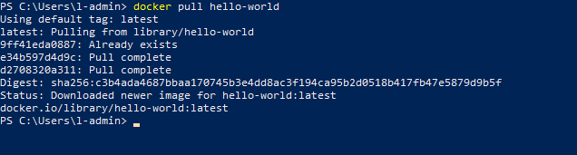

# Containers

## Objectives
- Run an `hello world` Container
- Containerize a ASP.NET Core Web App
- Develop in container

## Prerequisites

## What are containers?

- Visual Studio 2019
- .NET Core 2.2 Development Tools
- To publish to Azure Container Registry, an Azure subscription.

## What are containers?

Containers are a technology for packaging and running Windows and Linux applications across diverse environments on-premises and in the cloud. 
Containers provide a lightweight, isolated environment that makes apps easier to develop, deploy, and manage.
Containers start and stop quickly, making them ideal for apps that need to rapidly adapt to changing demand.
The lightweight nature of containers also make them a useful tool for increasing the density and utilization of your infrastructure.


You can run Windows-based or Linux-based containers on Windows 10 using [Docker Desktop](https://docs.docker.com/docker-for-windows/)
However, in this HOL we will use Windows Server 2019 with Containers support enabled, hence won't install Docker Desktop.


### References
- [https://docs.microsoft.com/en-us/virtualization/windowscontainers/about/](https://docs.microsoft.com/en-us/virtualization/windowscontainers/about/)
- [https://www.redhat.com/en/topics/containers/whats-a-linux-container](https://www.redhat.com/en/topics/containers/whats-a-linux-container)

## Why develop in containers?
- It works on my machine (then we'll ship you machine)

## Docker [:link:](https://docs.docker.com/)

### Docker Desktop [:link:](https://docs.docker.com/docker-for-windows/)
Docker is a full development platform for creating containerized applications. 
[Docker Desktop](https://docs.docker.com/docker-for-windows/) is the best way to get started with Docker on Windows.

### Docker Compose [:link:](https://docs.docker.com/compose)
Compose is a tool for defining and running multi-container Docker applications. 
With Compose, you use a YAML file to configure your application’s services. Then, with a single command, you create and start all the services from your configuration.

### References 
- [https://docs.docker.com/](https://docs.docker.com/)
- [https://docs.docker.com/docker-for-windows/](https://docs.docker.com/docker-for-windows/)
- [https://docs.docker.com/compose/](https://docs.docker.com/compose/)


## Excercise 1: Run the Hello-world container from Docker.Hub

1. In our VM open your preferred terminal - cmd, powershell, gitbash, cygwin, etc.


2. In the terminal run the following command to download the `hello-world:latest` image.
   The version tag `latest` is optional and the default value for this field is `latest`, for this reason you can omit the tag every time you use the `latest` version.
   However, it is a good practice to always specify it, expecially in scripts.

    ```bash
        docker pull hello-world:latest
    ```

3. Docker looks in the cache if an image with name `hello-world:latest` is present.
   We have never used this image, hence it can't find that and consequently it starts to download the image.
   When the download ends, docker extracts the download payload and exits.
   As result you will have the following:

    

4. In the terminal run the following command

    ```bash
        docker run hello-world:latest
    ```

5. Docker creates a container from the downloaded image `hello-world:latest`, and runs it.
   In case the image is not already downloaded it will download it at this time.
   In the run container a program that prints `Hello Docker` is executed.
   The result should be like the following:

   


## Containers orchestrators
- Docker Swarm
- Kubernetes
- Openshift

