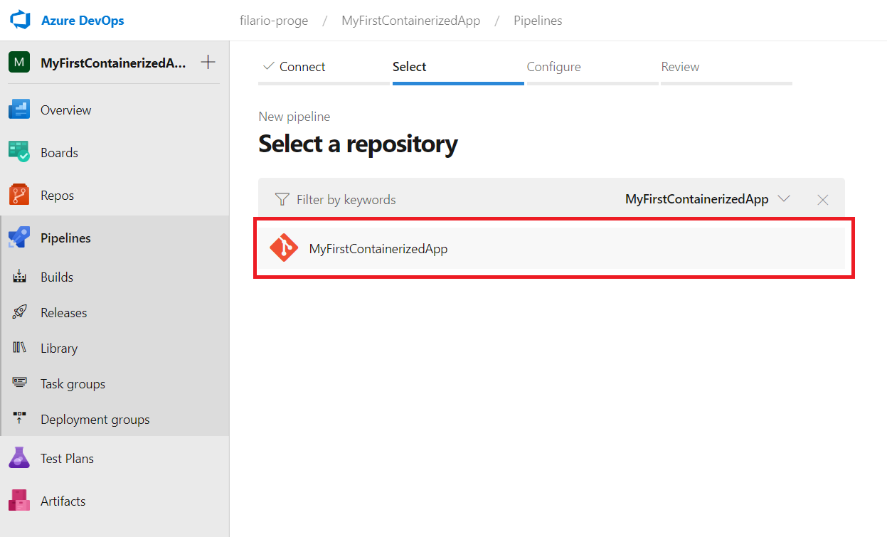
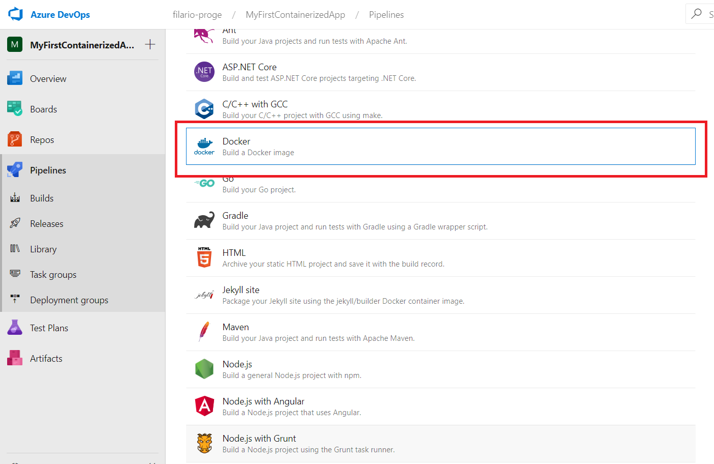
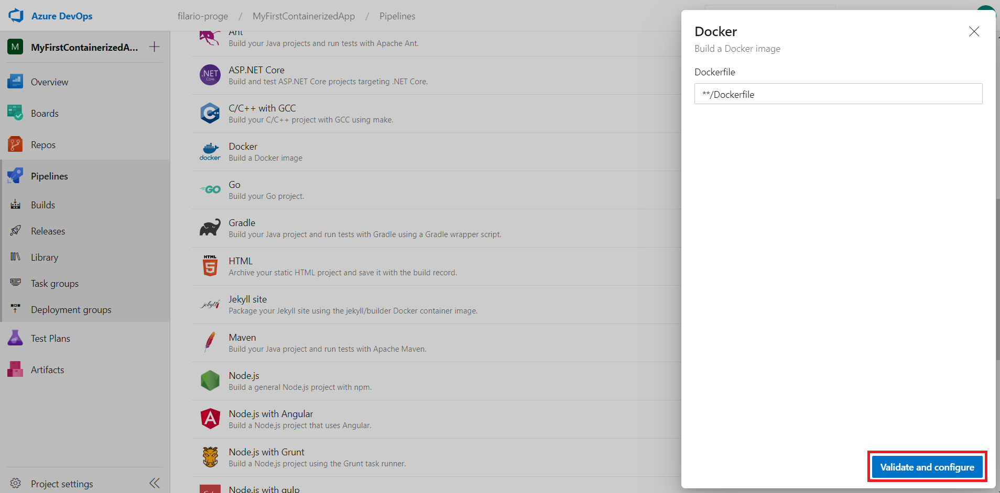
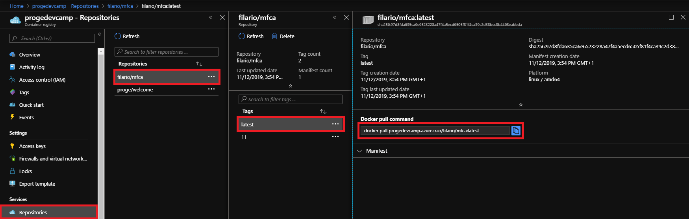

# Containers

## Objectives
- Run an `hello world` Container
- Containerize a ASP.NET Core Web App
- Develop in container

## Prerequisites

- Visual Studio 2019
- .NET Core 2.2 Development Tools
- To publish to Azure Container Registry, an Azure subscription.

## What are containers?

Containers are a technology for packaging and running Windows and Linux applications across diverse environments on-premises and in the cloud. 
Containers provide a lightweight, isolated environment that makes apps easier to develop, deploy, and manage.
Containers start and stop quickly, making them ideal for apps that need to rapidly adapt to changing demand.
The lightweight nature of containers also make them a useful tool for increasing the density and utilization of your infrastructure.


You can run Windows-based or Linux-based containers on Windows 10 using [Docker Desktop](https://docs.docker.com/docker-for-windows/)
However, in this HOL we will use Windows Server 2019 with Containers support enabled, hence won't install Docker Desktop.


### References
- [https://docs.microsoft.com/en-us/virtualization/windowscontainers/about/](https://docs.microsoft.com/en-us/virtualization/windowscontainers/about/)
- [https://www.redhat.com/en/topics/containers/whats-a-linux-container](https://www.redhat.com/en/topics/containers/whats-a-linux-container)

## Why develop in containers?
- It works on my machine (then we'll ship you machine)

## Docker [:link:](https://docs.docker.com/)

### Docker Desktop [:link:](https://docs.docker.com/docker-for-windows/)
Docker is a full development platform for creating containerized applications. 
[Docker Desktop](https://docs.docker.com/docker-for-windows/) is the best way to get started with Docker on Windows.

### Docker Compose [:link:](https://docs.docker.com/compose)
Compose is a tool for defining and running multi-container Docker applications. 
With Compose, you use a YAML file to configure your application’s services. Then, with a single command, you create and start all the services from your configuration.

### References 
- [https://docs.docker.com/](https://docs.docker.com/)
- [https://docs.docker.com/docker-for-windows/](https://docs.docker.com/docker-for-windows/)
- [https://docs.docker.com/compose/](https://docs.docker.com/compose/)


## Exercise 0: Install Docker-Desktop


## Exercise 1: Run the Hello-world container from Docker.Hub

1. Open your preferred terminal - cmd, powershell, gitbash, cygwin, etc.


2. In the terminal run the following command to download the `hello-world:latest` image.
   The version tag `latest` is optional and the default value for this field is `latest`, for this reason you can omit the tag every time you use the `latest` version.
   However, it is a good practice to always specify it, expecially in scripts.

    ```bash
        docker pull hello-world:latest
    ```

3. Docker looks in the cache if an image with name `hello-world:latest` is present.
   We have never used this image, hence it can't find that and consequently it starts to download the image.
   When the download ends, docker extracts the download payload and exits.
   As result you will have the following:

    

4. In the terminal run the following command

    ```bash
        docker run hello-world:latest
    ```

5. Docker creates a container from the downloaded image `hello-world:latest`, and runs it.
   In case the image is not already downloaded it will download it at this time.
   In the run container a program that prints `Hello Docker` is executed.
   The result should be like the following:

   


## Exercise 2: Execute an ASP.NET Core 3.0 sample container

1. Pull the ASP.NET Core sample image from [DockerHub](https://hub.docker.com)

    ```bash
        docker pull mcr.microsoft.com/dotnet/core/samples:aspnetapp
    ```

    


1. Run the sample 

    ```bash
        docker run -it --rm --port 8000:80 --name aspnetcore_sample mcr.microsoft.com/dotnet/core/samples:aspnetapp
    ```
    
    > **Explanation**
    > - **-it** runs the application in *interactive* mode, the run *container* is binded to the displaying shell
    > - **--rm** removes the *container* when the main program executed exits
    > - **--name** gives a unique human-readable name to the *container* that can be used instead of the long ID automatically provided to the *container*.
        A human-readable name is always given to a *container* even if not *defined*.
        If not explicitly defined it will be composed by an adjective and underscore and a name (like "quizzical_gararin", "flamboyant_beaver", or "jovial_dewdney").
    > - **--port** maps a port of the operative system running docker with one of the docker *container*

    


1. In a browser navigate to [http://localhost:8000](http://localhost:8000) to use the deployed sample

    


1. Open another terminal leaving the first one open and run the following command to display the list of currently running container

    ```bash
    docker ps
    ```

    


1. Deploy another container in detached mode, on port 8001, and without giving an explicit name

    ```bash
        docker run -d --rm -p 8001:80 mcr.microsoft.com/dotnet/core/samples:aspnetapp
    ```

    


1. Run again the command to display currently active containers and dockers will now display two container

    ```bash
    docker ps
    ```

    

1. Stop the containers using the ID of the container or the Name
   
   ```bash
   docker stop aspnetcore_sample
   docker stop {ID|NAME}
   ```

   Now calling `docker ps` will display an empty table

## Exercise 3: Create your first containerized web app

1. Open Azure DevOps

    

1. Create a new Project named `MyFirstContainerizedApp`

    

1. Select the `Repos` blade, then select the `Visual Studio` configuration for the .gitignore file and finally click `Initialize`

    

1. Click on the `Clone` button

    


1. Select `Clone in Visual Studio` use the arrow on the right of the clone button if it is not the default value.

    

1. Visual Studio 2019 will start.
   Set as directory the path `C:\Repo\DevCamp\HOL-15\MyFirstContainerizedApp` and hit `Clone`.

   

1. Visual Studio 2019 will download the repo and display you an project with a `README.md` and a `.gitinore` files.
   Now click on `File`, then `New` and finally on `Project...`

    

1. Select `ASP.NET Core Web Application` and click `Next`

    

1. Complete the form giving the Application the name `MyFirstContainerizedApp` and Location `C:\Repo\HOL-15\MyFirstContainerizedApp`.
   Finally hit `Create`.

    

1. Select `Enable Docker Support` and set `Linux` as type of Container and hit `Create`.

    

1. Now commit and push everything on the DevOps Git Repo.
   Click on the `pencil` in the bottom right of Visual Studio 2019.
   Then insert a message in the Box over the `Commit All` button and press that button.

   


1. Now in the bottom right of Visual Studio 2019 click on the arrow with a `1` at its right and finally press the `push` action link.

   


1. In the solution explorer open the `Controllers` folder and then the file `HomeController.cs`.
   Place a breakpoint on the `Privacy` method and run the application with Docker using the `Play` button.

    

1. Docker now starts to build the image, then runs a new container using the built image, and finally the home page of the application should be shown in your default browser.
   
   

1. In the web app click on the `Privacy` button in the navbar and the breakpoint in Visual Studio 2019 will be hit.
   Press the play button in Visual Studio 2019 (the same button you used to launch the application) to continue.


## Exercise 4: Create a build pipeline to the Proge's ACR (Azure Container Registry)

1. First of all we need to configure the service connections for the project.
   Click on `Project Settings`, then `Service connections`, `New Service connection` and finally `Docker Registry`.

    

1. Select `Azure Container Registry` as `Registry type`.
   Compile the form with `progedevcamp` as `Connection name`, `Microsoft Azure Sponsorship` as `Azure subscription`, and `progedevcamp` as `Azure container registry`.

    

1. Open the project in Azure DevOps click on the `Pipelines` Blade and then `Builds`.
   Hit the `New Pipelines` button.

    

1. Select `Azure Repos Git`

    

1. Select `MyFirstContainerizedApp`

    

1. Select `Docker`. If not showed use the button `Show more`.

    

1. Hit `Validate and configure`

    

1. Remove the task ADO has created for you, i.e. task `Docker@2`

    

1. On the right of the screen click on the `Show assistant` button and search for `Docker`
 
    

1. Select `Docker`

    

1. As container registry select `progedevcamp` and as Container repository insert `{YOUR_PROGE_MAIL_PREFIX}/mfca`.

    

1. A yaml configuration of the pipeline is shown now; hit the `Save and run` configuration

    

1. Hit `Save and run`

    

1. The build pipeline is now run

    

1. When the build pipeline is complete we will find our docker image pulled in the `devcamp` Azure Container Registry (ACR)

    


## Exercise 5: Run our docker image locally

1. In Portal open the `progedevcamp` ACR in `Corso-MS-Cloud` Resource Group, select the `Access Keys`, and take note of `Username` and `Password`

    

1. Open a powershell and run the following command to login docker in our ACR

    ```powershell
        docker login progedevcamp.azurecr.io
    ```

    When it asks for Username and Password, use the ones shown int the page `Access keys` of `progedevcamp`

1. Now we can pull the image we recently uploaded in the repository.
   Select the blade `Repositories` of `progedevcamp` ACR.
   Select your repository, then the latest tag and finally copy the `Docker pull command`.
   
   

1. In the previously opened Powershell run the copied Docker pull command.

   

1. Run a container built upon the downloaded image

    ```bash
        docker run -it --rm -p 9000:80 progedevcamp.azurecr.io/{YOUR_USERNAME}-mfca:{buildID}
    ```

    Then open a browser and go to [http://localhost:9000](http://localhost:9000)

    


## Exercise 6: Configure your App Service for Container to access Proge's ACR 

1. In Portal open the [Corso-MS-Cloud](https://portal.azure.com/#@progesoftware.it/resource/subscriptions/5d71b05c-3bd6-4055-836d-99b7558bd920/resourceGroups/Corso-MS-Cloud/overview) resource group and search your `containerapp` App Service

    

1. Select your `containerapp` instance and then click `Browse`

    

1. If it's all ok, the browsed site will appear like in the following picture

    

1. Use this [link](https://portal.azure.com/#@progesoftware.it/resource/subscriptions/5d71b05c-3bd6-4055-836d-99b7558bd920/resourceGroups/Corso-MS-Cloud/providers/Microsoft.ContainerRegistry/registries/progedevcamp/accessKey) to access the `Access keys` page of the Proge's Azure Container Registry for this Devcamp, and take note of the fields `Username` and `Password`.
   
    

1. In the resource group [Corso-MS-Cloud](https://portal.azure.com/#@progesoftware.it/resource/subscriptions/5d71b05c-3bd6-4055-836d-99b7558bd920/resourceGroups/Corso-MS-Cloud/overview) look for your Web App for Container and select it

    

1. Open the `Configuration` blade and use the pencil on the right of the following to update them with the `Access Keys` from the `progedevcamp` ACR 

    


## Exercise 7: Create a release pipeline that gets the image from container and deploy on a slot

1. In ADO select the `Releases` blade under the `Pipelines` one anche hit `New Pipeline`

    

1. Look for `containers`, select `Azure App Service deployment`, and click on the `Apply` button that will appear in the selected box.

    

1. Click on the tab `Tasks` and in the azure subscription select the `Microsoft Azure Sponsorship` one.

    

1. Click on the arrow in the button `Authorize` and select `Advanced Options`

    

1. Select the resource group `Corso-MS-Cloud` and hit `OK`

    

1. Fill the form as follows and finally hit `Save`:
   - App Type: `Web App for Containers (Linux)`
   - App service name: choose in the dropdown your containerapp
   - Registry or Namespace: `progedevcamp.azurecr.io`
   - Repository: {YOUR_PROGE_NAME}/mfca:latest

    

1. Now click the `Create Release` button

    

1. Hit `Create`

    

1. Click on the link `Release 1` contained in the notification appeared

    

1. Wait for the process to complete

    

1. In Azure Portal open the details of your container app Web Service in the resource group
   Corso-MS-Cloud, then click on the `Browse`button.
   
    

1. The browsed website is your running container and appear like the following image

    


## Containers orchestrators
- Docker Swarm
- Kubernetes
- Openshift

